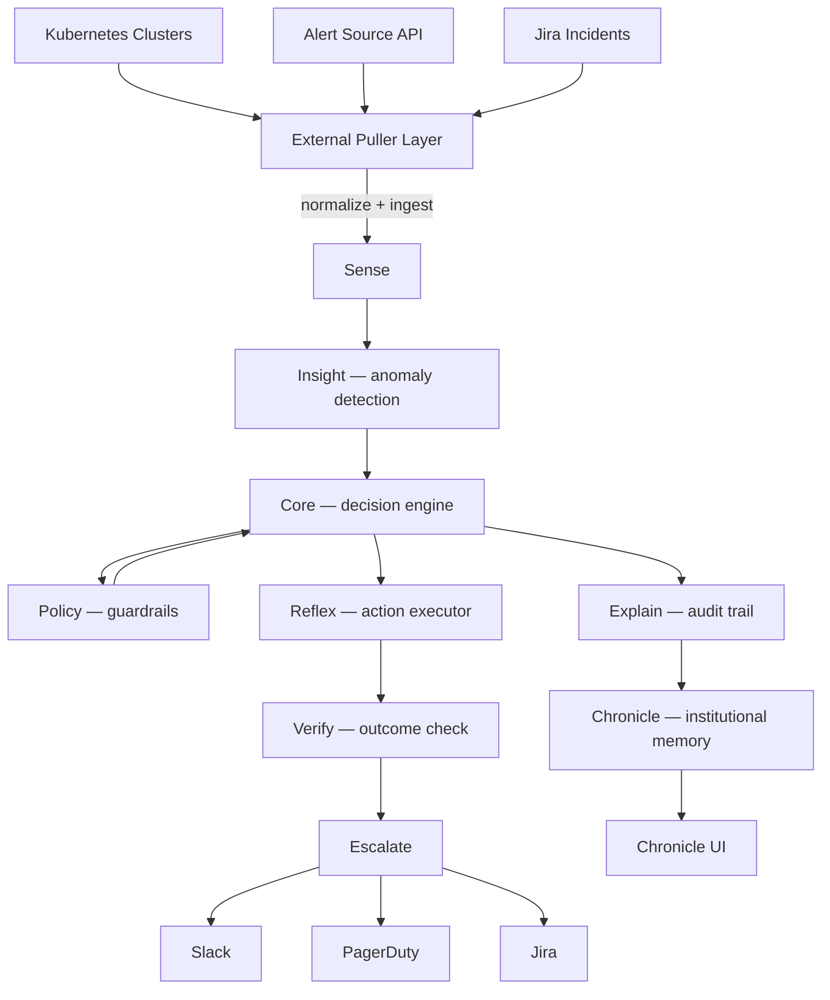

# Heron

**Autonomous incident intelligence for SRE and DevOps teams.**

Heron watches your infrastructure, detects what matters, decides what to do, acts on it, verifies the result, escalates when needed, and — crucially — *remembers everything* so the next incident resolves faster.

---

## The Problem

Modern infrastructure generates thousands of signals per hour. On-call engineers waste nights triaging noise, recreating runbooks they've already written, and escalating incidents that should have resolved themselves. Mean time to resolution stays stubbornly high not because engineers lack skill, but because institutional knowledge doesn't compound.

Heron solves this.

---

## The Closed Loop

```
Observe → Detect → Decide → Act → Verify → Escalate → Learn
```

Every incident drives the loop. Every loop makes the next one faster.

| Stage | Component | What it does |
|---|---|---|
| **Observe** | Sense | Ingests signals from Kubernetes, alert APIs, Jira, and custom sources |
| **Detect** | Insight | Threshold anomaly detection + signal correlation |
| **Decide** | Core | AI-assisted decision planning gated by Policy |
| **Act** | Reflex | Executes approved remediation actions |
| **Verify** | Verify | Confirms the action resolved the signal |
| **Escalate** | Escalate | Routes to Slack, PagerDuty, or Jira when human judgment is needed |
| **Learn** | Chronicle | Records every decision and outcome as institutional memory |

---

## Why Chronicle Is the Moat

Every other observability platform shows you what happened. Heron remembers *why* you made each decision and *whether it worked*.

Chronicle is a structured incident knowledge base that:
- Links signals → decisions → actions → outcomes in a queryable timeline
- Surfaces near-misses before they become outages
- Feeds past outcomes back into Core's decision ranking
- Generates postmortems automatically

The longer Heron runs, the better it gets. That compounding is not replicable by switching tools.

---

## Architecture



---

## Key Components

| Component | Role |
|---|---|
| **Sense** | Signal ingestion, normalization, alarm guard filtering |
| **Insight** | Threshold-based anomaly detection, signal windowing |
| **Core** | Decision planning with AI assistance and learn-loop ranking |
| **Policy** | Declarative guardrail evaluation (YAML-based rules) |
| **Reflex** | Action executor with configurable playbooks |
| **Verify** | Post-action outcome verification |
| **Escalate** | Multi-channel escalation routing (Slack / PagerDuty / Jira) |
| **Chronicle** | Incident timeline, postmortems, near-miss detection, what-if simulation |

---

## Integrations

| Integration | Type | Status |
|---|---|---|
| Kubernetes | Cluster hygiene + pod state monitoring | ✅ |
| Jira | Incident ingestion + ticket lifecycle | ✅ |
| PagerDuty | Escalation | ✅ |
| Slack | Escalation | ✅ |
| Alert Source API | Generic HTTP adapter (CloudWatch, Datadog, PagerDuty Alerts, etc.) | ✅ |
| Prometheus / Alertmanager | Via webhook ingest | Roadmap |
| GitHub Actions | Deployment correlation | Roadmap |

---

## Quick Start

### Option A — Demo mode (no infrastructure required)

```bash
git clone https://github.com/mzarifyar/heron-p.git
cd heron-p
cp .env.example .env
echo "HERON_DEMO_MODE=true" >> .env
docker compose up --build
```

Open `http://localhost:8080/chronicle` to watch the loop run with synthetic incidents.

### Option B — Docker with your stack

```bash
cp .env.example .env
# Edit .env — set JIRA_BASE_URL, JIRA_BEARER_TOKEN, and your alert source
docker compose up --build
```

### Option C — Local Python

Requires Python 3.11+.

```bash
python3 -m venv .venv && source .venv/bin/activate
pip install -r requirements.txt
cp .env.example .env   # edit as needed
uvicorn app.main:create_app --factory --host 0.0.0.0 --port 8080
```

---

## Environment Variables

| Variable | Default | Description |
|---|---|---|
| `HERON_DEMO_MODE` | `false` | Generate synthetic incidents; no real infra needed |
| `HERON_API_PORT` | `8080` | HTTP port |
| `HERON_ENV` | `local` | Environment tag |
| `HERON_REGION` | `us-east-1` | Region tag |
| `JIRA_BASE_URL` | — | Your Jira REST API base URL |
| `JIRA_BEARER_TOKEN` | — | Jira personal access token |
| `HERON_ALERT_SOURCE_HOST` | — | Base URL for alert source HTTP API |
| `HERON_DEVOPS_PORTAL_TARGETS_PATH` | `config/devops_portal_targets.json` | Alert target list |
| `HERON_INGEST_TOKEN` | — | Optional bearer token to protect `/sense/signals` |
| `HERON_PULLERS_SCHEDULER_ENABLED` | — | Override scheduler on/off |

See [`.env.example`](.env.example) for the full list.

---

## UI Endpoints (local)

| Path | What you see |
|---|---|
| `/chronicle` | Incident timeline, postmortems, Chronicle memory |
| `/pullers` | Puller scheduler status and manual triggers |
| `/ops/learn` | Learn loop summary and action rankings |
| `/jira-auth` | Browser-assisted Jira token bootstrap |
| `/docs` | OpenAPI / Swagger |

---

## Configuration Files

| File | Purpose |
|---|---|
| `config/pullers.yaml` | Enable/disable pullers and polling intervals |
| `config/policy.yaml` | Guardrail rules for the Policy engine |
| `config/actions.yaml` | Registered Reflex action playbooks |
| `config/thresholds.json` | Anomaly detection thresholds |
| `config/cluster_targets.json` | Kubernetes clusters to monitor |
| `config/devops_portal_targets.json` | Alert source polling targets |
| `config/control_plane.json` | Region and environment metadata |

---

## Roadmap

- [ ] Prometheus / Alertmanager native adapter
- [ ] Deployment correlation (GitHub Actions, ArgoCD)
- [ ] Multi-tenant SaaS mode (per-org Chronicle isolation)
- [ ] Web-based policy editor
- [ ] Chronicle search API with semantic recall
- [ ] Slack bot for interactive runbook approval

---

## License

MIT License — Copyright 2026 Mostafa Zarifyar. See [LICENSE](LICENSE).
